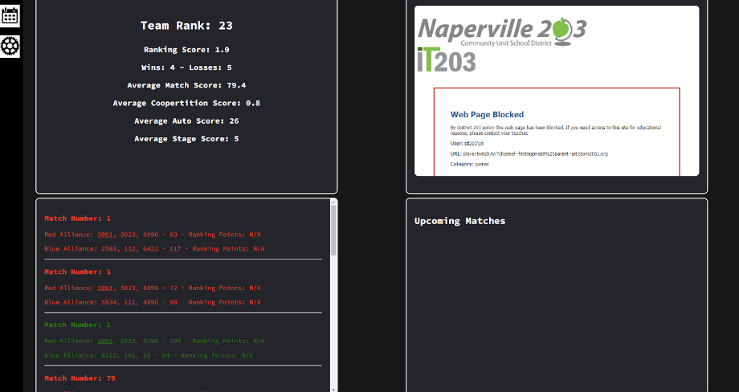
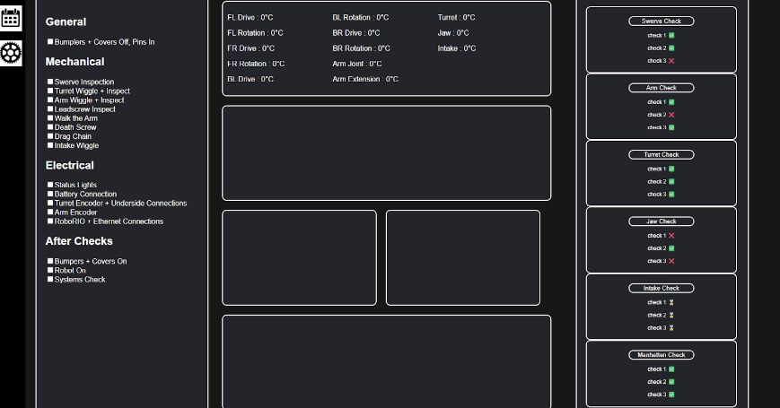

# Robotics Pit Display Application

The Robotics Pit Display is an application that is used during FIRST Robotics competitions. It is displayed in your robotics team’s pit using some sort of screen such as a monitor. It lists upcoming matches, match history, ranking information, as well as a live Twitch display on the first page. These are from the Blue Alliance API.

The second page is for monitoring the team’s robot functionalities, with the application connecting to the robot’s local server to gather information such as the temperature of the motors as well as the voltage input of different components of the robot. A checklist is included to help your team organize all checks on the robot while it is in the pit. Network Tables, a publish-subscribe messaging system that connects to the robot to get certain values, is used on the second page.

Here is a detailed overview of the project:

**First Page:**
Team stats: This displays our most important statistics from the current competition, allowing team members to plan and strategize accordingly.
Twitch stream: Allows members to keep the stream in view even when they are confined to the pit while working on the robot.
Past matches: Provides a helpful log of what Huskie Robotics’ past matches looked like (i.e. win/loss, red/blue alliance, points earned that match)
Upcoming matches: A schedule of all upcoming matches so the team has a good sense of when the robot needs to be ready for their next match and how much time they have between.

**Second Page (incomplete):**
Checklist: Useful when preparing for a match.
Temperature data: Uses network tables to get the temperatures of each motor and other parts of the robot to catch failures early.

This project is based on Ranger Robotics’ Flutter app: [Link](https://github.com/3015RangerRobotics/2023Public)

## Motivation

The Robotics team needs an easy and reliable way to access important data. By having a display that gathers it all in one place, it makes it way easier on the busy members of our robotics team to multi-task.

## Screenshots

## Platform Requirements

The operating systems that work with our project currently are Windows and Mac. We did not run it on Linux yet, so feel free to try. No external services are needed to use the project. As of current, here are the processing requirements:

- Windows: Windows 10 and 11 (64-bit)
- macOS: latest release and the two previous versions, with Apple security update support
- Linux (Debian): Ubuntu Desktop 20.04, Debian 10
- Linus (Red Hat): Red Hat Enterprise Linux 8, Fedora 36

## Data Schema Organization

In the website folder there is a JSON file titled “website.json”. The checklist on the second page displays whatever is in this json file.

To edit this JSON file, follow these steps:

- Open the JSON file using a text editor like vscode
- Locate the section you want to edit or add a new section if needed.
- To edit an existing item, find the specific task within the corresponding array and modify the text as needed.
- To add a new task, locate the array for the section where you want to add the task, and simply add a new string inside the array with the task description.
- Save the file once you've made your changes.

Your changes will now show up next time you load the website.

This project currently does not use any other data schemas.

## Technologies/Framework Used

Built with:

- JS: used to connect to the APIs and logic out which information we need placed and where in the html code.
- HTML: used to format the data and display it on the page.
- CSS: used to style the data to make our website more visually appealing and easy to read.

## How to Install and Run the Project:

In the VSCode terminal, run these commands:

- npm install node ← build scalable network applications
- npm install axios ← used to connect to Blue Alliance
- ritwickdey.LiveServer ← a VSCode extension that runs the project on web browser

### Instructions:

After cloning the project from the Robotics Pit Display Github, right click on the index.html file int the website folder and click on the “Open with Live Server” option. Make sure that you have a web browser, such as Chrome, opened in order for this to work.

When you have the project opened on your web browser, it should be identical to the screenshots shown in the screenshots section of this README. For the first page, it should show the rank box, the past matches box, the box with the embedded Twitch screen, and the upcoming matches box. The page should refresh every 5 minutes.

On the second page, there should be a working checklist on the left, and placeholder boxes for the information that is going to come from NetworkTables. The checklist clears every time the web page manually refreshes, and the refresh requirement from the first page does not affect this.

Click on the icons on the top-left of the screen to switch between the match information page and the robotics information page.

## Credits

The Robotics Pit Display was created by Arav Juneja, Georgia Riley, and Yutong Ji @ Naperville North High School for Huskie Robotics 2024.
